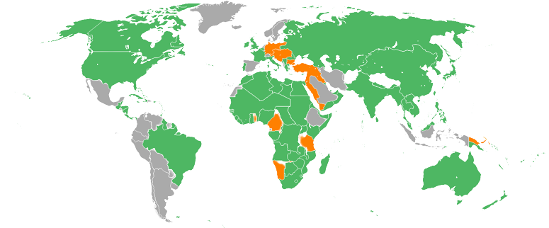

# Prima guerra mondiale
O **Grande guerra** 
Collegata ai [14 punti di Wilson](14%20punti%20di%20Wilson.md)
%% Genocidio Armeni!!!! E oggi?? %%
%% Ravages %%

## Geografia

### Fronte occidentale
#### Il piano Shlieffen

#### Battaglia delle frontiere

#### Battaglia della Marna

#### Corsa al mare

#### Prima linea stabilita

#### Fronte occidentale

#### Battaglia di Verdun

#### Battaglia dello [Jutland](luoghi/Jutland)

#### Battaglia della Somme

#### Ritirata [tedesca](luoghi/Germania)

#### Offensiava primaverile [tedesca](luoghi/Germania) 

#### Offensiva dei 100 giorni

### Fronte orientale
#### agosto - settembre

#### Battaglia di Tannenberg

#### ottobre - inverno

#### Seconda battaglia dei laghi Masuri

#### Ritirata [russa](luoghi/Russia)

#### marzo

#### Offensiva Brusilov

#### 1917

#### Linea dell'armistizio

### Fronte dei [Balcani](../luoghi/Balcani)
#### Battaglia del Cer

#### Battaglia del Kolubara

#### Collasso della Serbia

#### Fronte della Salonika

### Fronte [italo](../luoghi/Italia)-[austriaco](luoghi/Impero%20austro-ungarico)
#### Battaglie dell'Isonzo

#### Battaglia di Caporetto

#### Battaglia di Vittorio Veneto

### Fronte [romeno](../luoghi/Romania)
#### Avanzata romena

#### Offensiava poteri centrali

#### Le operazioni continuano

### Campagna della Mesopotamia

### Campagna di Gallipoli
#### Campagna dei Dardanelli

### Campagna [palestinese](../luoghi/Palestina)
#### Prima battaglia di Gaza

#### Operazioni

#### Battaglia di Megido

### Campagna del Caucaso
#### Fronte del Caucaso

### Teatro africano 
#### La Germania reclama l'Africa

#### La cartina di Delbruck

#### Fronte sud-occidentale africano
